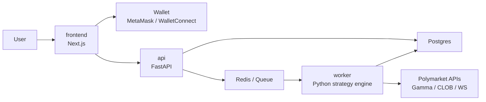

# Web App Architecture

## Goal

현재 저장소의 단일 사용자 Python 봇을 다음 형태의 제품으로 전환한다.

- 사용자는 웹앱에서 월렛을 연결한다.
- 사용자는 자신의 봇 설정을 저장하고 실행/중지할 수 있다.
- 백엔드는 사용자별 전략 워커를 실행해 Polymarket 시장을 감시하고 주문한다.
- 전략은 현재 단계에서는 "시장 추종"을 기본 가정으로 한다.
- 기존 룰 베이스 전략 코드는 참고 자산으로 유지하되, 웹앱 구조가 먼저 우선이다.

## Architecture Summary

상위 구조는 `frontend / api / worker / shared` 4개 영역으로 나눈다.

## Why This Split

### frontend

- 사용자 인증 진입점
- 월렛 연결
- 전략 설정 UI
- 실행 상태, 로그, 포지션, 주문, 손익 대시보드

### api

- 사용자/지갑 세션 관리
- 월렛 서명 검증
- 봇 설정 CRUD
- 워커 실행 요청/중지 요청
- 조회 API 제공
- Polymarket API credential 저장과 권한 경계 담당

### worker

- 시장 데이터 수집
- 전략 평가
- 리스크 관리
- 주문 제출과 체결 추적
- 봇 상태 저장

### shared

- 공통 도메인 모델
- 전략 인터페이스
- 설정 스키마
- 이벤트 타입
- DB와 API 사이에서 공통으로 쓰는 계약

## Recommended Tech Stack

### frontend

- Next.js 15
- React 19
- TypeScript
- Tailwind CSS
- wagmi + viem
- TanStack Query

### api

- FastAPI
- SQLAlchemy 2.x
- Pydantic 2
- PostgreSQL
- Redis

### worker

- Python 3.11+
- asyncio
- Redis consumer or scheduler loop
- Polymarket CLOB/Gamma/WebSocket clients

### shared

- Python package first
- 프론트엔드 계약은 OpenAPI client generation으로 동기화

이 선택 이유는 기존 코어 엔진이 Python이므로 전략/실행부를 재사용하기 쉽고, 브라우저 월렛 연동은 Next.js + wagmi가 가장 자연스럽기 때문이다.

## Execution Model

사용자별로 "봇 런타임"이 존재한다.

- 한 사용자는 0개 이상의 봇 설정을 가질 수 있다.
- 각 봇 설정은 하나의 전략, 리스크 설정, 대상 시장 필터를 가진다.
- 실행 중인 봇은 worker에서 주기 루프 + websocket 구독으로 동작한다.
- 단일 프로세스 안에서 여러 사용자 봇을 돌릴 수 있지만, 설계는 향후 분산 실행을 허용해야 한다.

초기 버전에서는 다음 모델을 권장한다.

- worker 한 프로세스
- DB에서 `ACTIVE` 봇 설정 로드
- 사용자별 런타임 인스턴스 구성
- 주기적으로 설정 변경 반영

## Wallet and Auth Model

중요한 점은 "웹앱 월렛 연결"과 "서버 측 자동매매"는 다른 문제라는 것이다.

### Browser Session

- 사용자는 프론트엔드에서 월렛 연결
- 서버가 nonce 발급
- 사용자가 nonce 서명
- API가 서명을 검증하고 세션 생성

### Trading Authorization

자동매매는 서버가 지속적으로 주문을 보내야 하므로, 브라우저 세션만으로는 부족하다.

초기 버전은 다음 두 단계로 나눈다.

1. 사용자가 월렛 연결 후 본인 주소를 인증한다.
2. 사용자가 "트레이딩 활성화" 시 Polymarket API용 자격을 서버에 등록한다.

실제 구현 방식은 Polymarket 인증 모델에 맞게 정해야 한다.

- 서버가 사용자를 대신해 계속 주문해야 하므로, 사용자별 CLOB API credential 또는 서버 서명 권한이 필요하다.
- 이는 일반 웹 로그인보다 보안 수준이 높다.

따라서 MVP에서는 반드시 아래 원칙을 둔다.

- read-only 연결과 live trading 활성화는 분리한다.
- 처음에는 `paper trading only`를 기본값으로 둔다.
- live trading은 별도 동의와 서버 저장 절차를 가진다.

## Strategy Direction

현재 단계에서 전략은 "시장 추종"으로 정의한다.

의미:

- 시장 역행 mean reversion보다 추세 확인 후 탑승
- 가격 자체와 체결 흐름을 우선 사용
- 외부 뉴스 알파는 나중 단계

초기 시장 추종 전략 후보:

- short-term breakout follow
- best bid/ask 이동 추세 추종
- recent trade direction persistence
- spread/volume 조건이 좋은 시장만 참여

기존 저장소의 오더북 불균형, 모멘텀, 차익거래는 참고 구현으로 유지한다.

## Domain Model

핵심 엔티티는 아래로 정리한다.

### User

- id
- wallet_address
- created_at

### BotConfig

- id
- user_id
- name
- mode: `paper | live`
- strategy_type: `market_follow`
- bankroll_limit
- max_position_pct
- max_open_positions
- daily_loss_limit
- market_filters
- status: `draft | active | paused | archived`

### BotRun

- id
- bot_config_id
- status: `starting | running | stopping | stopped | error`
- started_at
- stopped_at
- last_heartbeat_at

### Position

- id
- bot_run_id
- token_id
- condition_id
- side
- size
- entry_price
- current_price
- status
- realized_pnl
- unrealized_pnl

### Order

- id
- bot_run_id
- token_id
- polymarket_order_id
- side
- order_type
- requested_price
- requested_size
- filled_price
- filled_size
- status

### EventLog

- id
- bot_run_id
- level
- type
- message
- payload_json
- created_at

## Data Flow

### 1. User onboarding

- 월렛 연결
- nonce 서명
- API 세션 생성
- 봇 설정 생성

### 2. Bot start

- frontend가 start API 호출
- API가 `BotRun` 생성
- queue에 start job 발행
- worker가 runtime 인스턴스 생성

### 3. Market processing

- worker가 대상 마켓 목록 로드
- websocket 구독
- store/history 갱신
- 전략 평가
- 리스크 검증
- 주문 제출
- 주문/포지션/이벤트 DB 반영

### 4. UI refresh

- frontend는 polling 또는 SSE/WebSocket으로 상태 조회
- 실시간 로그, 포지션, 주문, PnL 반영

## API Surface

초기 API 범위는 아래 정도면 충분하다.

### auth

- `POST /auth/nonce`
- `POST /auth/verify`
- `POST /auth/logout`
- `GET /auth/me`

### bots

- `GET /bots`
- `POST /bots`
- `GET /bots/{botId}`
- `PATCH /bots/{botId}`
- `POST /bots/{botId}/start`
- `POST /bots/{botId}/stop`

### runs

- `GET /runs`
- `GET /runs/{runId}`
- `GET /runs/{runId}/positions`
- `GET /runs/{runId}/orders`
- `GET /runs/{runId}/events`

### markets

- `GET /markets`
- `GET /markets/{tokenId}`

## Worker Internals

worker는 현재 `src/main.py` 를 분해해서 아래 계층으로 옮긴다.

- `MarketDataService`
- `StrategyEngine`
- `RiskEngine`
- `ExecutionService`
- `RuntimeManager`

사용자별 런타임 인스턴스는 다음 책임을 가진다.

- 시장 필터 적용
- 구독 대상 token 관리
- 전략 인스턴스 보유
- 포지션 추적
- 주기 평가
- 실시간 청산
- 상태 persistence

## Persistence

### PostgreSQL

- 사용자
- 봇 설정
- 실행 상태
- 주문
- 포지션
- 이벤트 로그

### Redis

- start/stop job queue
- 런타임 heartbeat
- 단기 캐시
- websocket fanout 필요 시 pub/sub

## Security Constraints

- private key 원문 저장은 마지막 수단이어야 한다.
- 가능하면 Polymarket용 최소 권한 credential 저장 모델을 채택한다.
- live trading은 paper trading과 완전히 분리된 UI/설정 플로우를 가져야 한다.
- 모든 주문 이벤트는 감사 로그로 남긴다.
- 사용자가 언제든 즉시 stop 할 수 있어야 한다.

## MVP Scope

1. 웹 로그인: 월렛 nonce 서명
2. paper trading only
3. 시장 추종 전략 1개
4. 단일 봇 생성/시작/중지
5. 대시보드: 상태, 로그, 포지션, 손익

live trading은 MVP+1 단계로 미룬다.

## Non-Goals For Now

- 멀티 체인 지원
- 고빈도 차익거래
- 복수 전략 포트폴리오 최적화
- 카피 트레이딩
- 모바일 앱

## Success Criteria

- 웹앱에서 사용자별 봇을 만들고 실행할 수 있다.
- 봇은 브라우저를 닫아도 서버에서 계속 동작한다.
- 전략/주문/포지션 상태가 UI에 반영된다.
- paper trading 결과가 사용자별로 저장된다.
- 이후 live trading 연결을 붙일 수 있는 구조가 마련된다.
